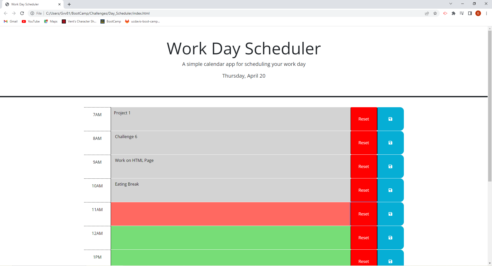
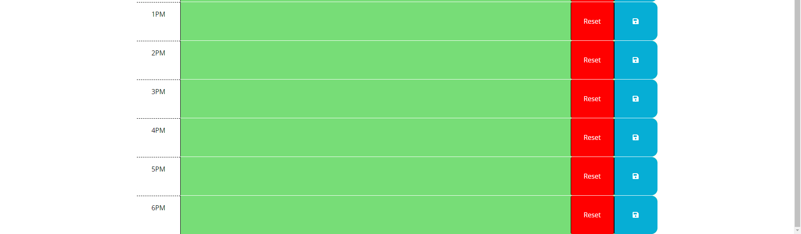
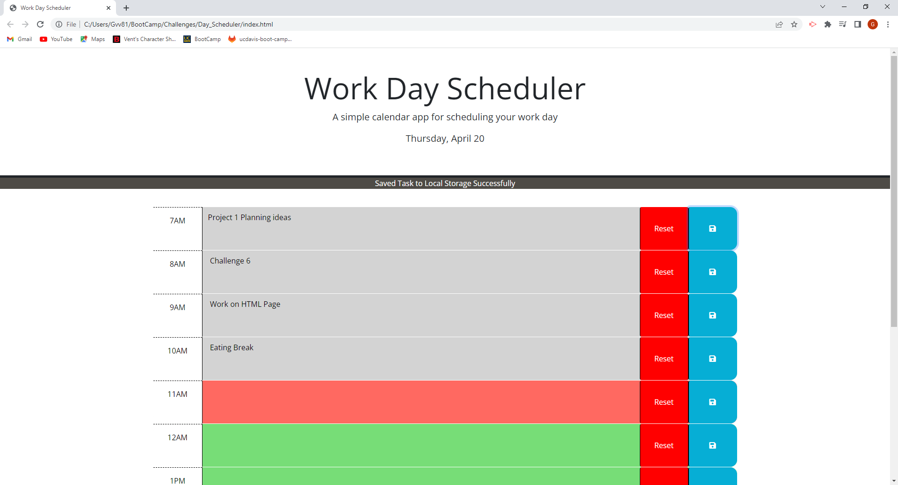
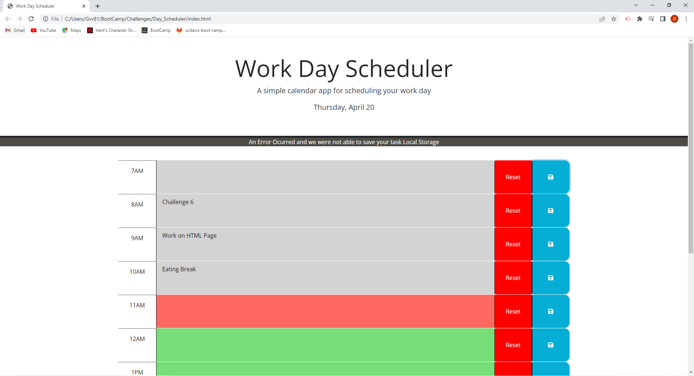

# Day Scheduler

## Description

I have been trying to organize my day a bit more to have more structure in my life. This stucture could be made by making a planner where I plan out my day. I have aquired enough skills to make a this possible by making a a day scheduler. On this day scheduler I should by able to put tasks I need to accomplish for the day there. In this project I got to use boot strap and jquery to build this project. Boot strap gave us all of the styling you see on the web page itself. Bootstrap is different than what I am used to. There is a grid system in place with methods in place to change the styling just in the html without actually chaning any css unless if you really want to. Then jquery is a different way to grab and access elements on the html file. Jquery acts similarly to how we get html elements in javascript, but we have a couple of different methods in jquery to search through other html elements based on current element we are looking at. 

## Installation

N/A

## Usage

The image above is displaying what users see when they initially load the web page we have. The first piece of text we see is work day scheduler with a date below. The date we see changes based on users current data. After seeing the date we can see the different time slots below for each hour. Now users can add text in the grey, red, or green empty spaces. its a text area where you can put your tasks for each hour. Then there is a save and reset button after each text area to either save the tasks after users close the page, or empty the text area. Assuming users close the web page all the tasks saved will be loaded into the text area for whatever hour users saved the task in. Another feature to mention here is that the different time slots have different text area colors. The colors will represent either past, present, or future. Past is grey, present is red, and future is green. The text area colors will change based on the current time of the users. I have made the program to update the colors every minute, so users do not have to hit the refresh button all the time.   

The image above shows what happens if you hit the save button in a text area. A prompt is given to show users that the data entered is saved succesfully. One thing to mention here is that all saved data is put in local storage, so if you really wanted to check you can look there. The only data validation I have here is making sure that each text area is not empty, if it is then no data will be saved and we get an error message as seen below. Now if users just put a bunch of spaces with no words or numbers it will be saved to local storage.  

## License

Please refer to repo for license

## Credits

Thank you Bootstrap and Jquery for letting me use your APIs.
